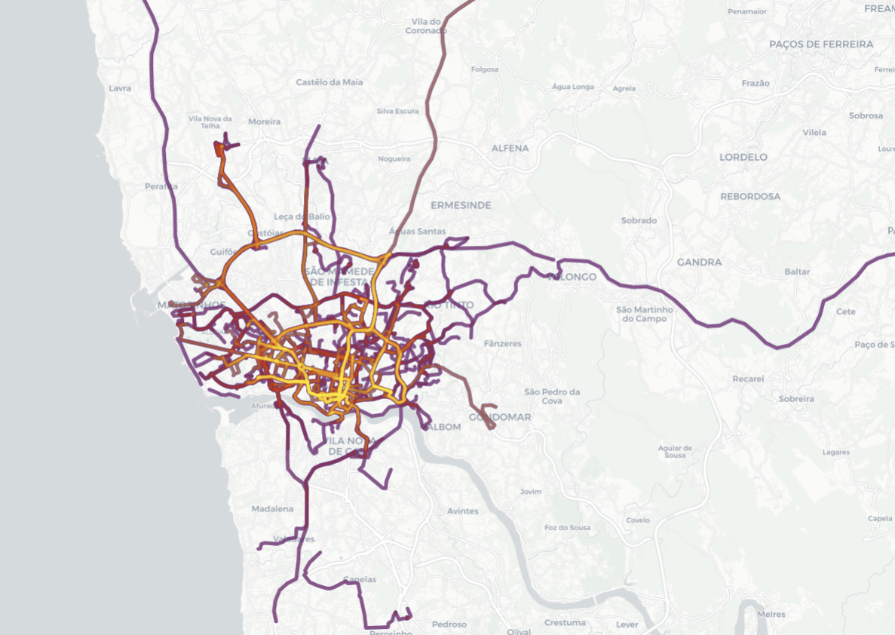

# Summary

fastgeotoolkit is a high‑performance JavaScript library for GPS trajectory analysis and route density visualisation. It introduces a novel segment‑based algorithm that treats GPS tracks as sequences of connected line segments rather than as disconnected point clouds. By counting overlaps at the segment level, the library produces density maps that accurately reflect actual route usage, independent of GPS sampling rates or device noise. The tool runs natively in web browsers via WebAssembly, requires no server infrastructure, and integrates seamlessly with popular mapping libraries such as Leaflet and MapLibre GL JS. fastgeotoolkit makes advanced geospatial analysis accessible to researchers, urban planners, ecologists, and citizen scientists who need fast, reproducible, and browser‑based route analysis without complex preprocessing or proprietary software.

# Statement of need

Accurate mapping of route usage is fundamental to transportation research, trail management, urban planning, and movement ecology. Researchers need to quantify how often different paths are used, identify congestion points, and evaluate infrastructure impacts. However, existing tools and methods suffer from three critical limitations:

1. **Sampling bias** – GPS devices record positions at varying rates; point‑based methods (kernel density estimation, clustering) amplify these inconsistencies, making cross‑dataset comparisons unreliable.
2. **Parameter sensitivity** – Kernel bandwidth, grid size, and other parameters greatly influence results, hindering reproducibility and standardisation.
3. **Proprietary barriers** – Commercial platforms like Strava employ segment‑based algorithms internally but keep their implementations closed, preventing open science and independent verification.

fastgeotoolkit directly addresses these problems by providing the first open‑source, segment‑based route density implementation. Its algorithm normalises spatial coordinates to a tolerance grid, converts each segment to a hashable key, and counts occurrences across all tracks. This approach eliminates sampling‑rate artefacts and removes the need for arbitrary kernel parameters. The target audience includes researchers in environmental informatics, transportation science, ecology, and anyone analysing human or animal movement patterns. The library lowers the barrier to high‑quality route analysis by enabling browser‑native workflows with minimal dependencies.

# State of the field

Existing geospatial software falls into three categories:

- **General‑purpose GIS** (QGIS, ArcGIS) and **statistical environments** (R `sf`, `sp`, Python `scipy`) offer kernel density and clustering tools, but treat GPS points independently and do not exploit the linear structure of routes. Their point‑based nature inherently introduces the biases described above.
- **Specialised trajectory packages** (e.g., `trajpy`, `move`) focus on trajectory preprocessing, interpolation, or similarity measures, but do not provide built‑in route density visualisation that is sampling‑rate‑invariant.
- **Commercial platforms** (Strava, RideWithGPS) use proprietary segment‑based algorithms; their results are often cited in research, but the algorithms are black boxes, preventing reproducibility and methodological transparency.

The only openly available alternative that approximates segment‑based analysis is to manually split tracks into short segments and then rasterise, a process that is computationally expensive and error‑prone. fastgeotoolkit fills this gap by offering a robust and performance‑optimised implementation.

Our benchmarks show that fastgeotoolkit is **15.5× faster** at GPX parsing and **45.7× faster** at density computation than a Python‑based workflow using GeoPandas, while using only a fraction of the memory (see Research Impact Statement). This performance advantage makes client-side browser‑based analysis of large datasets feasible for the first time, particularly on mobile devices.

# Software design

The design of fastgeotoolkit is driven by three interconnected goals: **sampling‑rate independence**, **computational efficiency**, and **accessibility**.

**Algorithmic trade‑offs** – Instead of rasterising points, we snap coordinates to a regular grid (tolerance parameter) and represent each segment as a pair of normalised integer coordinates. This transforms the continuous spatial problem into a discrete hashing problem, allowing O(1) lookups for segment frequencies. The trade‑off is a slight loss of spatial precision (controlled by the tolerance), but this is acceptable for most route‑analysis applications and, crucially, it eliminates the sampling‑rate bias inherent in point‑based methods.

**Architecture** – The core algorithm is implemented in Rust for memory safety and maximum performance, then compiled to WebAssembly using `wasm‑pack`. This architecture enables near‑native execution speed in the browser while keeping the library lightweight and portable. The JavaScript/TypeScript wrapper provides a clean, idiomatic API that integrates directly with Leaflet and MapLibre GL JS, so users can overlay density layers on interactive maps without leaving their web application.

**Why this matters** – By making the library browser‑native, we eliminate the need for server setup, containerisation, or complex dependencies. This design choice democratises advanced route analysis: a researcher can simply open a web page, upload a collection of GPX files, and obtain a publication‑ready density map within seconds. The deterministic nature of the segment‑based algorithm also ensures that results are reproducible across runs and platforms, a critical requirement for open science.

{width="100%"}

Figure 1 demonstrates a visualization application of fastgeotoolkit. A heatmap of Porto taxi driver trips shows high-traffic corridors while also preserving less-frequented routes.

# Research impact statement

fastgeotoolkit has credible research applications and tangible research impact. 

- A manuscript titled *"Quantifying Trail‑Induced Fragmentation in Protected Natural Areas Using Large‑Scale GPS Trajectory Analysis"* was produced following an investigation made possible by fastgeotoolkit. A preprint is available on EarthArXiv (doi:10.31223/X57V2Z) and the manuscript is currently under review in the Journal of Environmental Informatics. The analysis code and data are deposited on Zenodo (doi:10.5281/zenodo.20869713). This work applies fastgeotoolkit to assess how trail networks fragment wildlife habitats, directly informing conservation policy.

- Under testing conditions with thousands of GPS traces, fastgeotoolkit was shown to reduce GPX parsing time from 138.8 s (GeoPandas) to 8.97 s, representing a 15.5x increase in speed. Density computation runtime was reduced from 383.9 s to 8.41 s using fastgeotoolkit as opposed to the existing alternative, a 45.7x speedup. In both of htese cases, fastgeotoolkit used approximately 8x less memory than the status quo solution. These performance gains make large‑scale route analysis practical on consumer hardware and in web environments, thereby lowering the entry barrier for consumer applications, as well as researchers with limited computational resources.

These signals collectively establish credible near‑term significance and real‑world research utility.

# AI usage disclosure

Limited use of generative AI tools was employed in the preparation of this work. Large language models were used for routine code autocompletion during software development, as well as in the creation of helper scripts and tooling. All algorithmic design, architectural decisions, performance optimization, testing, and the intellectual content of the software and manuscript were performed by the human authors. The authors reviewed and verified all AI‑suggested changes to ensure accuracy and coherence.

# Acknowledgements

The authors thank the open‑source geospatial community, including contributors to Turf.js and MaplibreJS, for feedback and contributions during development.

# References

[^1]: fastgeotoolkit npm package: https://www.npmjs.com/package/fastgeotoolkit  
[^2]: Source code repository: https://github.com/username/fastgeotoolkit (replace with actual URL)
